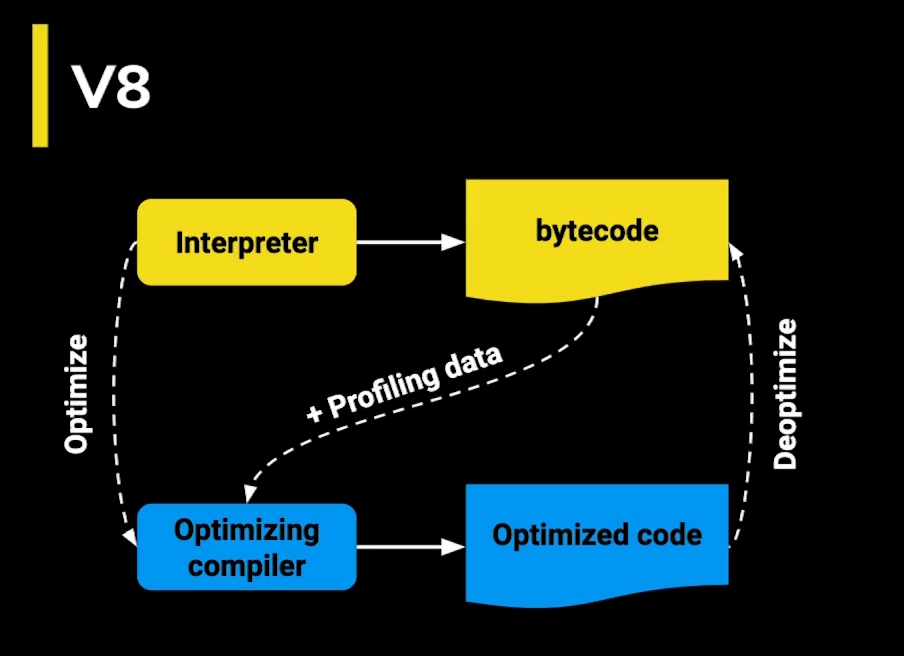
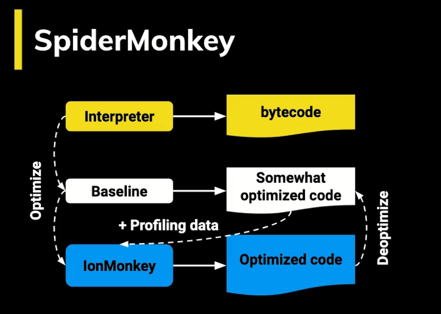
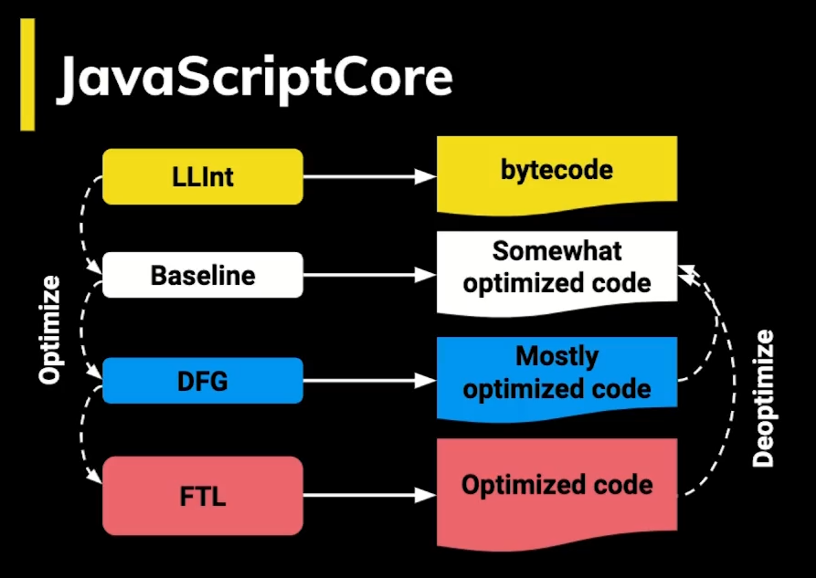

# Profesional Javascript Course

## Project: Media Player - Platzi

# Fundamentos de JavaScript

#### Cómo llega un script al navegador

El **DOM** es la representación que hace el navegador de un documento HTML.

El navegador interpreta el archivo HTML y cuando termina de transformarlo al DOM se dispara el evento DOMContentLoaded lo que significa que todo el documento está disponible para ser manipulado.

Todo script que carguemos en nuestra página tiene un llamado y una ejecución.

Tanto con async como defer podemos hacer llamados asíncronos pero tiene sus diferencias:

- **async** Con async podemos hacer la petición de forma asíncrona y no vamos a detener la carga del DOM hasta que se haga la ejecución del código.

- **defer** La petición es igual asíncrona como en el async pero va a deferir la ejecución del Javascript hasta el final de que se cargue todo el documento.

Hay que tener en cuenta que cuando carga una página y se encuentra un script a ejecutar toda la carga se detiene. Por eso se recomienda agregar tus scripts justo antes de cerrar el body para que todo el documento esté disponible.

### Scope

El Scope o ámbito es lo que define el tiempo de vida de una variable, en que partes de nuestro código pueden ser usadas.

#### Global Scope

Variables disponibles de forma global se usa la palabra var, son accesibles por todos los scripts que se cargan en la página. Aquí hay mucho riesgo de sobreescritura.

#### Function Scope

Variables declaradas dentro de una función sólo visibles dentro de ella misma (incluyendo los argumentos que se pasan a la función).

#### Block Scope

Variables definidas dentro de un bloque, por ejemplo variables declaradas dentro un loop while o for. Se usa let y const para declarar este tipo de variables.

#### Module Scope

Cuando se denota un script de tipo module con el atributo type="module las variables son limitadas al archivo en el que están declaradas.

## Closures

Son funciones que regresan una función o un objeto con funciones que mantienen las variables que fueron declaradas fuera de su scope.

Los closures nos sirven para tener algo parecido a variables privadas, característica que no tiene JavaScript por default. Es decir encapsulan variables que no pueden ser modificadas directamente por otros objetos, sólo por funciones pertenecientes al mismo.

## this

**this** se refiere a un objeto, ese objeto es el que actualmente está ejecutando un pedazo de código.

No se puede asignar un valor a this directamente y este depende de en que scope nos encontramos:

- Cuando llamamos a this en el Global Scope o Function Scope, se hace referencia al objeto window. A excepción de cuando estamos en strict mode que nos regresará undefined.

- Cuando llamamos a this desde una función que está contenida en un objeto, this se hace referencia a ese objeto.

- Cuando llamamos a this desde una “clase”, se hace referencia a la instancia generada por el constructor.

## Los métodos **call**, **apply** y **bind**

Estas funciones nos sirven para establecer el valor de this, es decir cambiar el contexto que se va usar cuando la función sea llamada.

Las funciones call, apply y bind son parte del prototipo Function. Toda función usa este prototipo y por lo tanto tiene estas tres funciones.

- `functionName.call()` Ejecuta la función recibiendo como primer argumento el this y los siguientes son los argumentos que recibe la función que llamó a call.

- `functionName.apply()` Ejecuta la función recibiendo como primer argumento el this y como segundo un arreglo con los argumentos que recibe la función que llamó a apply.

- `functionName.bind()` Recibe como primer y único argumento el this. No ejecuta la función, sólo regresa otra función con el nuevo this integrado.

#### Currying:

_Es un proceso en programación funcional en el cuál podemos transformar una función con multiples argumentos en una secuencias de funciones anidadas, retorna una nueva función que espera el nuevo argumento en la lista._

## Prototype

En Javascript todo son objetos, no tenemos clases, no tenemos ese plano para crear objetos.

Todos los objetos “heredan” de un prototipo que a su vez hereda de otro prototipo y así sucesivamente creando lo que se llama la prototype chain.

La keyword **new** crea un nuevo objeto que “hereda” todas las propiedades del prototype de otro objeto. No confundir prototype con proto que es sólo una propiedad en cada instancía que apunta al prototipo del que hereda.

## Herencia Prototipal

Por default los objetos en JavaScript tienen cómo prototipo a **Object** que es el punto de partida de todos los objetos, es el prototipo padre. Object es la raíz de todo, por lo tanto tiene un prototipo padre undefined.

Cuando se llama a una función o variable que no se encuentra en el mismo objeto que la llamó, se busca en toda la prototype chain hasta encontrarla o regresar undefined.

La función hasOwnProperty sirve para verificar si una propiedad es parte del objeto o si viene heredada desde su **prototype chain**.

# ¿Como Funciona Javascript?

## Parsers

- _JavaScript es Interpretado_
- _La web no es como antes_

## ¿Qué hace un JS Engine?

- Recibe **código fuente**
- **Parsea el código** y produce un **Abstract Syntax Tree (AST)**
- Se compila a **bytecode** y se **ejecuta**
- Se optimiza a **machine code** y se **reemplaza al código base**

### JavaScript Engine Grafo:

### ¿Qué hace un Parser?

### Google Dice:

- **Parsing** es **15-20%** del proceso de ejecución
- La **mayoría** del código JavaScript de una página nunca se ejecuta
- Esto hace que un **bundling y code splitting** sean muy importantes

## Parser de V8

### Eager Parsing:

- Encuentra códigos de Sintaxis
- Crea el **AST**
- Construye Scopes

### Lazy Parsing:

- Doble de rápido que el eager parsing
- No crea el AST
- Construye los scopes Parcialmente

## Demo Tokens

[Ejemplo de Demo Tokens](https://esprima.org/demo/parse.html#)

## Abstract Syntax Tree (AST)

Es un grafo (estructura de datos) que representa un programa:

Se usa en:

- JavaScript Engine
- Bundlers: Webpack, Rollup, Parcel
- Transpilers: Babel
- Linters: ESLint, Prettify
- Type Checkers: TypeScript, Flow
- Syntax Highlighters

### Ejemplo de como se usa el AST

[Ejemplo de AST con ESLint](https://astexplorer.net/#/gist/16fc27fc420f705455f2b42b6c804aa1/53cf94b7c80d6c221ee893ca3b93a4d21844bffa)

## ¿Cómo funciona JavaScript Engine?

- Una vez tenemos el **AST** ahora hay que convertirlo a Bytecode.

- **Bytecode** es como el **código assembler** pero en lugar de operar en el procesador opera en la máquina virtual V8 del navegador.

- **Machine code** es el más bajo nivel, es código binario que va directo al procesador.

- **El profiler** se sitúa en medio del bytecode y el optimizador

- Cada máquina virtual tiene sus particularidades, por ejemplo V8 tiene algo llamado Hot Functions.

- Cuando una sentencia función es ejecutada muy frecuentemente, V8 la denomina como una hot function y hace una optimización que consiste en convertirla a machine code para no tener que interpretarla de nuevo y agilizar su ejecución.

### Bytecode:

- Bytecode es parecido a assembly
- Es portatil
- Ejecutado por virtual machine

### Machine Code:

- Binario
- Instrucciones específicas a una arquitectura o a un procesador

## Cada navegador tiene su implementación de JavaScript Engine:

### v8 - Google:

### SpiderMonkey - Firefox:

### Chackra - Edge:

### JavaScriptCore - Safari:

# Event Loop

El Event Loop hace que Javascript parezca ser multihilo a pesar de que corre en un solo proceso.

Javascript se organiza usando las siguientes estructuras de datos:

- **Stack** Va apilando de forma organizada las diferentes instrucciones que se llaman. Lleva así un rastro de dónde está el programa, en que punto de ejecución nos encontramos.

- **Memory Heap** De forma desorganizada se guarda información de las variables y del scope.

- **Schedule Tasks** Aquí se agregan a la cola, las tareas programadas para su ejecución.

- **Task Queue** Aquí se agregan las tares que ya están listas para pasar al stack y ser ejecutadas. El stack debe estar vacío para que esto suceda.

- **MicroTask Queue** Aquí se agregan las promesas. Esta Queue es la que tiene mayor prioridad.

El Event Loop es un loop que está ejecutando todo el tiempo y pasa periódicamente revisando las queues y el stack moviendo tareas entre estas dos estructuras.
